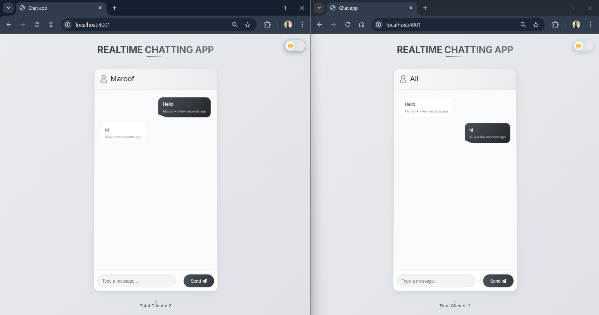
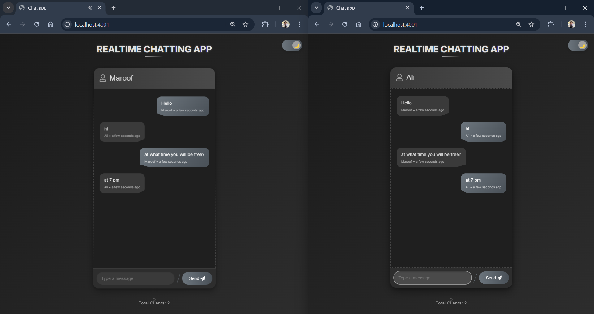

# Realtime Chat Bot Using WebSockets  

A modern, real-time chat application built using **Node.js, Express, Socket.IO, and WebSockets**. This project allows multiple users to connect, chat instantly, and see who's typing, with a sleek UI featuring dark mode and a dynamic typing indicator.  

### 📥 Project Introduction Video

https://drive.google.com/file/d/1caqi4R8KmRJAJgkscI0iylkjNUx0O837/view?usp=drive_link


## 🚀 Features  
- **Real-Time Messaging** – Instant message delivery using WebSockets via Socket.IO.  
- **Typing Indicator** – Animated dots appear when a user is typing, enhancing the interactive experience.  
- **Dark Mode** – Toggle between light and dark themes with a smooth transition.  
- **User Naming** – Customizable usernames with a default "Enter name" field that clears on first focus.  
- **Client Count** – Displays the total number of connected users in real-time.  
- **Responsive Design** – Clean, modern UI with subtle animations and gradients.  

## 📸 Screenshots  

### Light Mode Chat Interface  
  

### Dark Mode with Typing Indicator  
  

## 🔧 Prerequisites  
- [Node.js](https://nodejs.org/) (v14 or higher recommended)  
- npm (comes with Node.js)  

## 📥 Installation  

1. **Clone the repository:**  
   ```bash
   git clone https://github.com/your-username/Realtime-Chat-bot-Using-WebSockets.git
   cd Realtime-Chat-bot-Using-WebSockets
   ```  

2. **Install dependencies:**  
   ```bash
   npm install
   ```  

3. **Ensure you have a `public` folder with the following files:**  
   ```
   public/
   ├── index.html        # Main HTML file
   ├── style.css         # Styling with light/dark mode
   ├── main.js           # Client-side logic with Socket.IO
   └── message-tone.mp3  # (Optional) Audio for message notifications
   ```  

## ▶️ Usage  

1. **Start the server:**  
   ```bash
   node app.js
   ```  
   Or, if you have **nodemon** installed for auto-reloading:  
   ```bash
   npm install -g nodemon
   nodemon app.js
   ```  

2. **Open your browser and navigate to:**  
   ```
   http://localhost:4001
   ```  

3. **Test real-time chatting:**  
   - Open multiple tabs or devices.  
   - Enter a name in the input field (clears "Enter name" on focus).  
   - Type a message and hit "Send" or press Enter.  
   - Toggle dark mode using the button in the top-right corner.  
   - Watch the typing indicator and client count update live.  

## 📂 Project Structure  

```
Realtime-Chat-bot-Using-WebSockets/
├── public/
│   ├── index.html       # Main HTML file
│   ├── style.css        # Styling with light/dark mode
│   ├── main.js          # Client-side logic with Socket.IO
│   └── message-tone.mp3 # (Optional) Audio for message notifications
├── app.js               # Server-side code with Express and Socket.IO
├── package.json         # Node.js dependencies and scripts
└── README.md            # This file
```

## 📦 Dependencies  

- **Express** – Web framework for Node.js  
- **Socket.IO** – Real-time bidirectional event-based communication  
- **Moment.js** – (Optional) Used for formatting timestamps (client-side)  
- **Font Awesome** – Icons for user and send button (via CDN)  

Install them with:  
```bash
npm install express socket.io
```  

## ⚙️ How It Works  

- **Server (`app.js`)** – Sets up an Express server with Socket.IO to handle WebSocket connections. Tracks connected clients and broadcasts messages and typing events.  
- **Client (`main.js`)** – Connects to the server via Socket.IO, handles user input, updates the UI, and manages dark mode and typing indicators.  
- **UI (`style.css`)** – Provides a responsive design with light/dark themes, animations, and a modern aesthetic.  

## 🤝 Contributing  

Feel free to **fork this repo, submit issues, or create pull requests**. Contributions are always welcome! 🚀  

---
